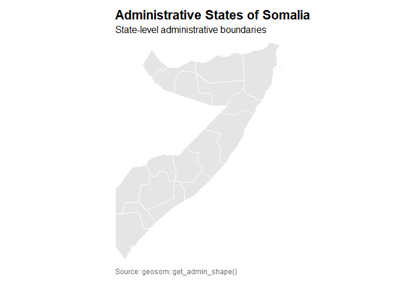

<!-- README.md is generated from README.Rmd. Please edit that file -->


# geosom

<!-- badges: start -->

[](https://lifecycle.r-lib.org/articles/stages.html#experimental)
<!-- badges: end -->

geosom is providing ready-to-use geographic boundary shapes and other
country datasets in Somalia for easy spatial analysis and mapping
workflows in R.

## Installation

You can install the development version from Github:

``` r
# install.packages("devtools")
remotes::install_github("axmedmaxamuud/geosom")
```

## Available Layers

``` r
library(geosom)
library(ggplot2)
library(dplyr)
#> 
#> Attaching package: 'dplyr'
#> The following objects are masked from 'package:stats':
#> 
#>     filter, lag
#> The following objects are masked from 'package:base':
#> 
#>     intersect, setdiff, setequal, union

list_geosom_layers()
#>    layer                       description
#> 1 admin0         Somalia national boundary
#> 2 admin1 Administrative level 1 boundaries
#> 3 admin2 Administrative level 2 boundaries
#> 4 states          Somalia state boundaries
```

## Load administrative boundaries

``` r
admin0 <- get_admin_shape("admin0")
admin1 <- get_admin_shape("admin1")
admin2 <- get_admin_shape("admin2")
states <- get_admin_shape("states")
```

## Get administrative names

``` r
head(get_admin_names("admin1"), 10)
#>     admin1name admin1pcod admin0name
#> 1        Awdal       SO11    Somalia
#> 2       Bakool       SO25    Somalia
#> 3      Banadir       SO22    Somalia
#> 4         Bari       SO16    Somalia
#> 5          Bay       SO24    Somalia
#> 6    Galgaduud       SO19    Somalia
#> 7         Gedo       SO26    Somalia
#> 8       Hiraan       SO20    Somalia
#> 9  Middle Juba       SO27    Somalia
#> 10  Lower Juba       SO28    Somalia
```

``` r
head(get_admin_names("admin2"), 10)
#>    admin2name admin2pcod      admin1name admin1pcod
#> 1     Banadir     SO2201         Banadir       SO22
#> 2      Borama     SO1101           Awdal       SO11
#> 3        Baki     SO1102           Awdal       SO11
#> 4     Lughaye     SO1103           Awdal       SO11
#> 5      Zeylac     SO1104           Awdal       SO11
#> 6    Hargeysa     SO1201 Woqooyi Galbeed       SO12
#> 7     Berbera     SO1202 Woqooyi Galbeed       SO12
#> 8     Gebiley     SO1203 Woqooyi Galbeed       SO12
#> 9       Burco     SO1301        Togdheer       SO13
#> 10  Buuhoodle     SO1302        Togdheer       SO13
```

## Basic map

``` r

admin1 <- get_admin_shape("admin1")


ggplot(admin1) +
  geom_sf(fill = "grey90", color = "white", linewidth = 0.35) +
  coord_sf(expand = FALSE) +
  labs(
    title = "Administrative States of Somalia",
    subtitle = "State-level administrative boundaries",
    caption = "Source: geosom::get_admin_shape()"
  ) +
  geosom_theme()
```


\## Population data

``` r
admin2 <- get_admin_shape("admin2")

admin2_pop <- admin2 |>
  left_join(
    population_admin2_2026,
    by = c("admin2pcod" = "admin2_pcode")
  )

head(admin2_pop, 10)
#> Simple feature collection with 10 features and 25 fields
#> Geometry type: MULTIPOLYGON
#> Dimension:     XY
#> Bounding box:  xmin: 42.68301 ymin: 1.979731 xmax: 47.10101 ymax: 11.51147
#> Geodetic CRS:  WGS 84
#>    admin2name admin2pcod      admin1name admin1pcod   area_km2 admin0_name
#> 1     Banadir     SO2201         Banadir       SO22   241.1582     Somalia
#> 2      Borama     SO1101           Awdal       SO11  3088.9583     Somalia
#> 3        Baki     SO1102           Awdal       SO11  3420.8104     Somalia
#> 4     Lughaye     SO1103           Awdal       SO11  3336.3785     Somalia
#> 5      Zeylac     SO1104           Awdal       SO11  6042.0472     Somalia
#> 6    Hargeysa     SO1201 Woqooyi Galbeed       SO12 13703.3329     Somalia
#> 7     Berbera     SO1202 Woqooyi Galbeed       SO12 10251.8092     Somalia
#> 8     Gebiley     SO1203 Woqooyi Galbeed       SO12  4276.3816     Somalia
#> 9       Burco     SO1301        Togdheer       SO13 16069.3030     Somalia
#> 10  Buuhoodle     SO1302        Togdheer       SO13  6795.5722     Somalia
#>        admin1_name admin2_name year male_under_5 female_under_5 total_under_5
#> 1          Banadir  Cabdulasis 2026         1525           1411          2936
#> 2            Awdal      Borama 2026        45596          42210         87806
#> 3            Awdal        Baki 2026         6985           6466         13451
#> 4            Awdal     Lughaye 2026         7600           7036         14636
#> 5            Awdal      Zeylac 2026         7021           6500         13521
#> 6  Woqooyi Galbeed    Hargeysa 2026       110454         102252        212706
#> 7  Woqooyi Galbeed     Berbera 2026        20067          18577         38644
#> 8  Woqooyi Galbeed     Gebiley 2026        22401          20738         43139
#> 9         Togdheer       Burco 2026        54979          50897        105876
#> 10        Togdheer   Buuhoodle 2026        10289           9525         19814
#>    male_5_17 female_5_17 total_5_17 male_18_59 female_18_59 total_18_59
#> 1       3411        3324       6735       2722         3018        5740
#> 2      94823       89145     183968      72215        82857      155072
#> 3      14525       13656      28181      11062        12692       23754
#> 4      15806       14859      30665      12035        13810       25845
#> 5      14601       13727      28328      11119        12759       23878
#> 6     229702      215945     445647     174930       200716      375646
#> 7      41731       39232      80963      31781        36465       68246
#> 8      46587       43795      90382      35476        40707       76183
#> 9     114338      107489     221827      87072        99907      186979
#> 10     21397       20115      41512      16295        18696       34991
#>    male_60_plus female_60_plus total_60_plus male_total female_total
#> 1           381            381           762       8039         8134
#> 2         10609          11287         21896     223243       225499
#> 3          1625           1729          3354      34197        34543
#> 4          1769           1880          3649      37210        37585
#> 5          1634           1737          3371      34375        34723
#> 6         25699          27341         53040     540785       546254
#> 7          4668           4966          9634      98247        99240
#> 8          5212           5545         10757     109676       110785
#> 9         12793          13609         26402     269182       271902
#> 10         2394           2547          4941      50375        50883
#>    population_total
#> 1             16173
#> 2            448742
#> 3             68740
#> 4             74795
#> 5             69098
#> 6           1087039
#> 7            197487
#> 8            220461
#> 9            541084
#> 10           101258
#>                                                                                  source
#> 1  Somalia District-level population estimates for humanitarian response planning, 2026
#> 2  Somalia District-level population estimates for humanitarian response planning, 2026
#> 3  Somalia District-level population estimates for humanitarian response planning, 2026
#> 4  Somalia District-level population estimates for humanitarian response planning, 2026
#> 5  Somalia District-level population estimates for humanitarian response planning, 2026
#> 6  Somalia District-level population estimates for humanitarian response planning, 2026
#> 7  Somalia District-level population estimates for humanitarian response planning, 2026
#> 8  Somalia District-level population estimates for humanitarian response planning, 2026
#> 9  Somalia District-level population estimates for humanitarian response planning, 2026
#> 10 Somalia District-level population estimates for humanitarian response planning, 2026
#>                          geometry
#> 1  MULTIPOLYGON (((45.6172 2.1...
#> 2  MULTIPOLYGON (((43.35094 10...
#> 3  MULTIPOLYGON (((44.2366 10....
#> 4  MULTIPOLYGON (((44.07241 10...
#> 5  MULTIPOLYGON (((43.46797 11...
#> 6  MULTIPOLYGON (((44.69096 8....
#> 7  MULTIPOLYGON (((45.86225 10...
#> 8  MULTIPOLYGON (((43.55642 9....
#> 9  MULTIPOLYGON (((46.04943 10...
#> 10 MULTIPOLYGON (((47.01258 8,...
```
