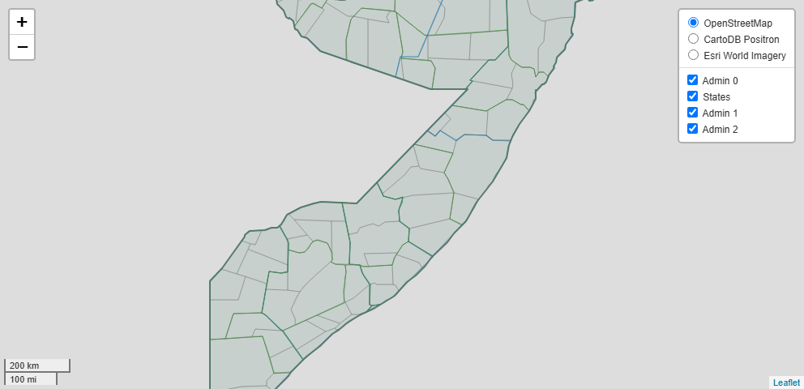

<!-- README.md is generated from README.Rmd. Please edit that file -->


# geosom

<!-- badges: start -->

[](https://lifecycle.r-lib.org/articles/stages.html#experimental)
<!-- badges: end -->

geosom is providing ready-to-use geographic boundary shapes and other
country datasets in Somalia for easy spatial analysis and mapping
workflows in R.

## Installation

You can install the development version from Github:

``` r
# install.packages("devtools")
remotes::install_github("axmedmaxamuud/geosom")
```

## Available Layers

``` r
library(geosom)
library(ggplot2)
library(dplyr)

list_geosom_layers()
#>    layer                       description
#> 1 admin0         Somalia national boundary
#> 2 admin1 Administrative level 1 boundaries
#> 3 admin2 Administrative level 2 boundaries
#> 4 states          Somalia state boundaries
```

## Load administrative boundaries

``` r
admin0 <- get_admin_shape("admin0")
admin1 <- get_admin_shape("admin1")
admin2 <- get_admin_shape("admin2")
states <- get_admin_shape("states")
```

## Get administrative names

``` r
head(get_admin_names("admin1")[, 1:3], 10)
#>     admin1name admin1pcod admin0name
#> 1        Awdal       SO11    Somalia
#> 2       Bakool       SO25    Somalia
#> 3      Banadir       SO22    Somalia
#> 4         Bari       SO16    Somalia
#> 5          Bay       SO24    Somalia
#> 6    Galgaduud       SO19    Somalia
#> 7         Gedo       SO26    Somalia
#> 8       Hiraan       SO20    Somalia
#> 9  Middle Juba       SO27    Somalia
#> 10  Lower Juba       SO28    Somalia
```

``` r
head(get_admin_names("admin2")[, 1:3], 10)
#>    admin2name admin2pcod      admin1name
#> 1     Banadir     SO2201         Banadir
#> 2      Borama     SO1101           Awdal
#> 3        Baki     SO1102           Awdal
#> 4     Lughaye     SO1103           Awdal
#> 5      Zeylac     SO1104           Awdal
#> 6    Hargeysa     SO1201 Woqooyi Galbeed
#> 7     Berbera     SO1202 Woqooyi Galbeed
#> 8     Gebiley     SO1203 Woqooyi Galbeed
#> 9       Burco     SO1301        Togdheer
#> 10  Buuhoodle     SO1302        Togdheer
```

## Basic map

``` r

admin1 <- get_admin_shape("admin1")


ggplot(admin1) +
  geom_sf(fill = "grey90", color = "white", linewidth = 0.35) +
  coord_sf(expand = FALSE) +
  labs(
    title = "Administrative States of Somalia",
    subtitle = "State-level administrative boundaries",
    caption = "Source: geosom::get_admin_shape()"
  ) +
  geosom_theme()
```


## Population data

``` r
admin2 <- get_admin_shape("admin2")

admin2_pop <- admin2  %>% 
  left_join(
    population_admin2_2026,
    by = c("admin2pcod" = "admin2_pcode")
  )

head(admin2_pop[, 2:10], 10)
#> Simple feature collection with 10 features and 9 fields
#> Geometry type: MULTIPOLYGON
#> Dimension:     XY
#> Bounding box:  xmin: 42.68301 ymin: 1.979731 xmax: 47.10101 ymax: 11.51147
#> Geodetic CRS:  WGS 84
#>    admin2pcod      admin1name admin1pcod   area_km2 admin0_name     admin1_name
#> 1      SO2201         Banadir       SO22   241.1582     Somalia         Banadir
#> 2      SO1101           Awdal       SO11  3088.9583     Somalia           Awdal
#> 3      SO1102           Awdal       SO11  3420.8104     Somalia           Awdal
#> 4      SO1103           Awdal       SO11  3336.3785     Somalia           Awdal
#> 5      SO1104           Awdal       SO11  6042.0472     Somalia           Awdal
#> 6      SO1201 Woqooyi Galbeed       SO12 13703.3329     Somalia Woqooyi Galbeed
#> 7      SO1202 Woqooyi Galbeed       SO12 10251.8092     Somalia Woqooyi Galbeed
#> 8      SO1203 Woqooyi Galbeed       SO12  4276.3816     Somalia Woqooyi Galbeed
#> 9      SO1301        Togdheer       SO13 16069.3030     Somalia        Togdheer
#> 10     SO1302        Togdheer       SO13  6795.5722     Somalia        Togdheer
#>    admin2_name year male_under_5                       geometry
#> 1   Cabdulasis 2026         1525 MULTIPOLYGON (((45.6172 2.1...
#> 2       Borama 2026        45596 MULTIPOLYGON (((43.35094 10...
#> 3         Baki 2026         6985 MULTIPOLYGON (((44.2366 10....
#> 4      Lughaye 2026         7600 MULTIPOLYGON (((44.07241 10...
#> 5       Zeylac 2026         7021 MULTIPOLYGON (((43.46797 11...
#> 6     Hargeysa 2026       110454 MULTIPOLYGON (((44.69096 8....
#> 7      Berbera 2026        20067 MULTIPOLYGON (((45.86225 10...
#> 8      Gebiley 2026        22401 MULTIPOLYGON (((43.55642 9....
#> 9        Burco 2026        54979 MULTIPOLYGON (((46.04943 10...
#> 10   Buuhoodle 2026        10289 MULTIPOLYGON (((47.01258 8,...
```

## Interactive Web Map

`geosom`can display interactive web map of administrative boundaries.

``` r
library(geosom)

geosom_leaflet()
```


