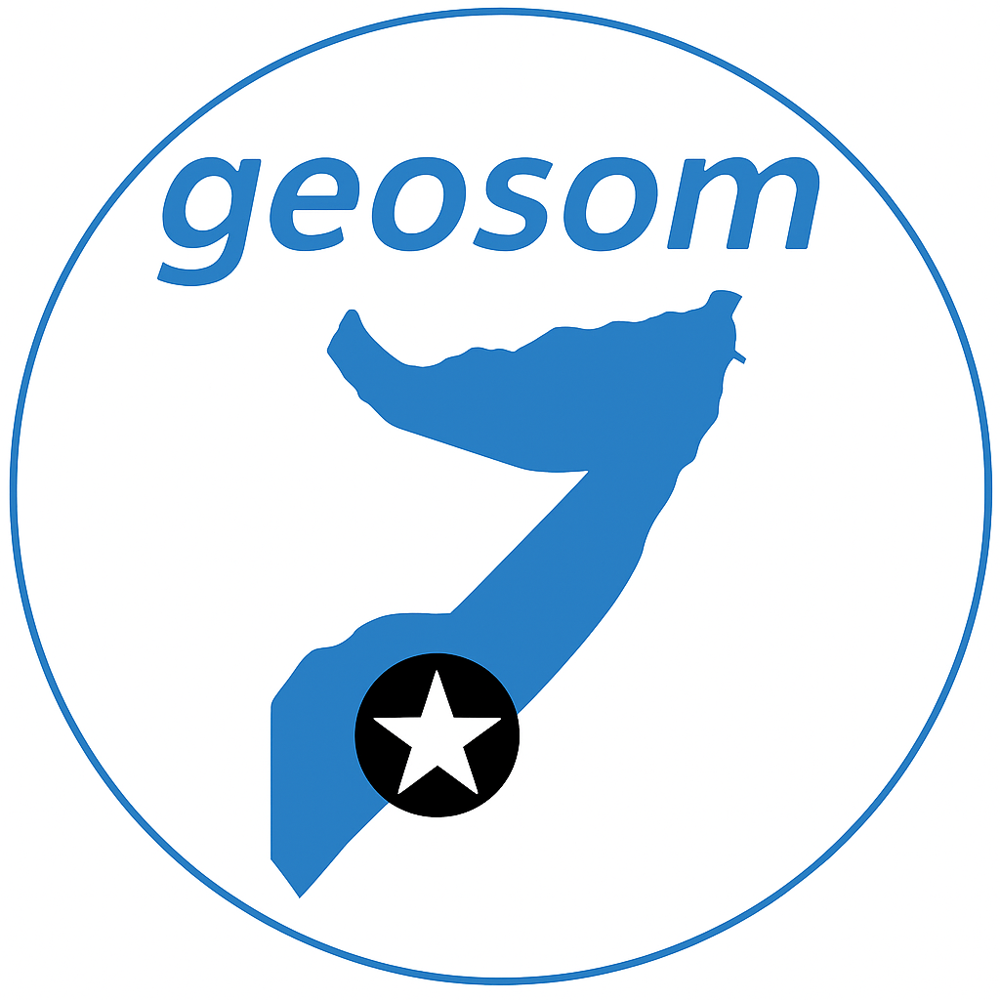

<!-- README.md is generated from README.Rmd. Please edit that file -->

# geosom



<!-- badges: start -->

[](https://lifecycle.r-lib.org/articles/stages.html#experimental)
<!-- badges: end -->

The goal of geosom package is to facilitate accessing Somalia geographic
boundary and country data by providing ready to use functions to obtain
administrative level boundaries that can be easily integrated with other
libraries for futher analysis and visualization.

## Installation

You can install the development version from Github:

``` r
# install.packages("devtools")
remotes::install_github("axmedmaxamuud/geosom")
```
